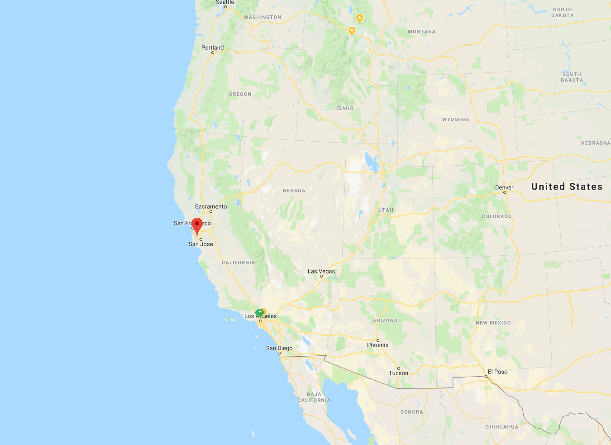

<h3>Host: Natarajan Shankar</h3>

Dates: 28 October -- 1 November, 2019
Host: Natarajan Shankar
Location: <a href="http://www.jrclosaltos.org/conferences-outside-groups">The Jesuit Retreat Center (JRC) of Los Altos</a>

<h3>Talks</h3>

<ul>

<li>Rajeev Joshi, <em>An introduction to Rust</em></li>
<li>Peter Müller, <em>Modular Verification of Safe Rust Programs</em></li>
<li>Pamela Zave, <em>Plan for a Research Project</em></li>
<li>Rustan Leino, <em>Cheaper Compiler Correctness</em></li>
<li>Manfred Broy, <em>It is Time for Time: Semantic Foundation and a Calculus for Specification and Verification for Concurrent Distributed Interactive Systems (CoDIS) without tears</em></li>
<li>Alberto Griggio, <em>SMT-based satisfiability for continuous-time temporal logic</em></li>
<li>Gerwin Klein, <em>Mechanising Bilateral Proof</em></li>
<li>Toby Murray, <em>Practical Verified Information Flow for Concurrent Programs</em></li>
<li>Graeme Smith, <em> </em></li>
<li>Michael Butler, <em>A bit Rust-y: Abstraction/refinement for functional correctness of tree algorithms</em></li>
<li>Rajeev Joshi, <em>Concurrency in Rust</em></li>
<li>Stephan Merz, <em>Another Look at Auxiliary Variables</em></li>
<li>Ian Hayes, <em>How does one specify a concurrent abstract data type?</em></li>
<li>Daniel Jackson, <em>Certified Control</em></li>
<li>Clark Barrett, <em>Towards Verification of Deep Neural Networks</em></li>
<li>Mike Dodds, <em>Repairable Software Proofs</em></li>
<li>Sam Blackshear, <em></em></li>
<li>Natarajan Shankar, <em>Redesigning Computing with Efficient Arguments</em></li>
<li>Corina Pasareanu, <em>Compositional Reasoning and Neural Networks</em></li>
<li>Rustan Leino, <em> </em></li>
<li>Oded Padon, <em> </em></li>
<li>Yoni Zohar,<em>Bit-vectors of Arbitrary Width</em></li>
</ul>
